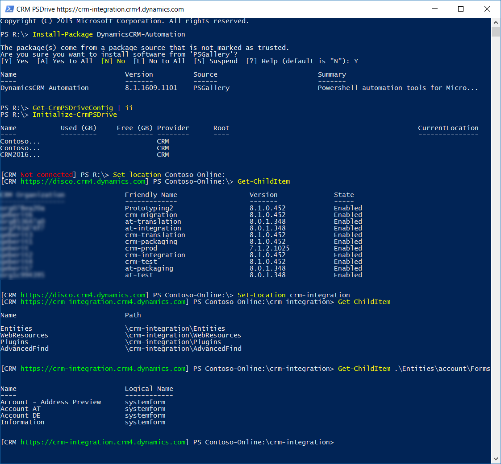

# PowerShell Library for Microsoft Dynamics CRM

<a href="https://github.com/ostools/DynamicsCRM-Automation"></a>

**DynamicsCRM-Automation** is a PowerShell library for Microsoft Dynamics CRM project related tasks automation. 
The library targets different areas of a Dynamics CRM Project life cycle, e.g. consulting, development, support or maintenance.

[](https://ci.appveyor.com/project/JozsefHorvath/dynamicscrm-automation)
[](https://ci.appveyor.com/project/JozsefHorvath/dynamicscrm-automation-ndmcj)

<br/>

## Resources

* [Wiki](https://github.com/ostools/dynamicscrm-automation/wiki)
* [Examples](https://github.com/ostools/dynamicscrm-automation/wiki/CmdletReference.md)
  * [Development Automation](https://github.com/ostools/dynamicscrm-automation/wiki/CmdletReference.md)
  * [Staging Automation](https://github.com/ostools/dynamicscrm-automation/wiki/CmdletReference.md)
  * [Quality Assurance Automation](https://github.com/ostools/dynamicscrm-automation/wiki/CmdletReference.md)
  * [Maintenance Automation](https://github.com/ostools/dynamicscrm-automation/wiki/CmdletReference.md)
* [Cmdlet Reference](https://github.com/ostools/dynamicscrm-automation/wiki/CmdletReference.md)
* [Cmdlet Provider Reference](https://github.com/ostools/dynamicscrm-automation/wiki/CmdletReference.md)

## Quick Start

The following quickstarts shows you:
- how to install using [OneGet](https://github.com/OneGet/oneget) from [PowerShell Gallery](https://www.powershellgallery.com/gettingstarted) (``` $ Install-Package DynamicsCRM-Automation ```),
- open connection configuration to edit (``` $ Get-CrmPSDRiveConfig | ii ```),
- initialize the CRM PS drives (``` $ Initialize-CrmPSDrive ```),
- connect to one deployment (``` $ Set-Location Contoso-Online ```),
- list organizations on deployment (``` $ Get-ChildItem ```),
- list the account forms (``` Get-ChildItem .\Entities\account\Forms ```))

<a href="https://github.com/ostools/DynamicsCRM-Automation"></a><br />

## Examples

Coming soon.

## Release Notes

Coming soon.